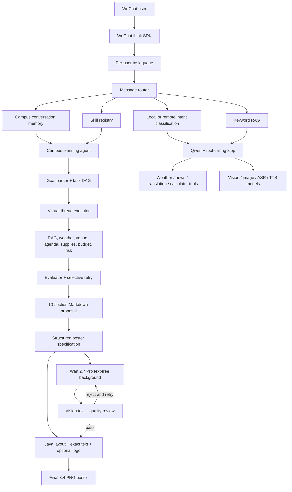

# CampusPilot AI


**A WeChat-native AI agent that turns a short campus event request into a practical, reviewable event plan.**

CampusPilot AI combines multi-turn conversation memory, a dependency-aware planning agent, RAG, function calling, multimodal AI, and deterministic validation in a Java/Spring Boot application. It can generate a complete campus event proposal, remember follow-up changes from the same WeChat contact, and revise the plan without confusing a school or venue name with an unrelated weather request.

> 中文简介：CampusPilot AI 是一个运行在微信中的校园活动策划 Agent。用户可以先获得通用方案，再连续补充学校、场地、日期、人数、预算和开始时间；系统会按联系人保存上下文、合并修改并重新生成完整方案。

## Why CampusPilot AI?

Many chatbot demos stop at a single LLM request. CampusPilot AI implements the surrounding engineering needed for a usable agent workflow:

- **Multi-turn campus planning** — remembers the current event per WeChat contact and merges natural-language updates such as `人数改80` or `换到西区食堂三楼`.
- **Dependency-aware agent orchestration** — decomposes a planning goal into a 12-task DAG covering rules, weather, venue, agenda, staffing, supplies, budget, publicity, and risk.
- **Evaluator-driven output** — validates dates, capacity, weather alignment, budget arithmetic, task completeness, and source boundaries before rendering a proposal.
- **Live campus venue discovery** — locates a named school with AMap and turns nearby building, hall, and sports-field POIs into concrete candidates with map links.
- **Production-style event posters** — generates a different text-free AI background for each event, then renders exact titles, school names, dates, times, venues, and optional school logos with deterministic Java layouts.
- **Safe generic defaults** — produces a useful plan even when details are missing, while clearly marking assumptions instead of blocking the user.
- **RAG with trust labels** — separates `VERIFIED` project knowledge from `TEMPLATE` campus guidance so demo material is not presented as a real university policy.
- **Parallel tool execution** — uses Java 21 virtual threads for independent tool calls and same-layer agent tasks.
- **Multimodal WeChat interaction** — handles text, images, inbound SILK voice messages, speech recognition, image generation, and WAV speech replies.
- **Operational guardrails** — keeps real booking, purchasing, payment, and message publishing outside the automated boundary.

The agent loop, tool protocol, task graph, RAG router, evaluator, and checkpoint recovery are implemented directly in Java rather than hidden behind a general-purpose agent framework.

## Example Conversation

```text
User: 帮我策划一次校园技术分享会

CampusPilot AI:
Returns a complete, editable plan using clearly marked defaults
for missing date, venue, attendance, and budget details, followed by
a vertical draft poster with pending fields visibly marked as pending.

User: 我是在南京信息工程大学明德楼举行

CampusPilot AI:
Updates the saved venue and regenerates the plan. It does not
query Nanjing weather because the user did not ask about weather.

User: 人数改80，预算改成3000元，下周三15点30开始

CampusPilot AI:
Merges all four changes into the same event and regenerates the
agenda, staffing, supplies, budget, and action checklist.

User: 这个活动还有什么风险？

CampusPilot AI:
Uses the saved event summary to answer the follow-up question.
```

Conversation state is isolated by WeChat contact, expires after 120 minutes by default, and can be cleared with `重新策划`, `清除方案`, or `结束策划`.
Recall and fact questions such as `你还记得刚才的活动吗` or `这个活动在哪举行` read the saved plan without being treated as field updates or new event names.

## Architecture



### Message routing order

1. Apply an active campus conversation update or reset command.
2. Match a deterministic `Skill` such as campus planning or a daily brief.
3. Match an explicit campus-poster generation or retry command.
4. Retrieve local RAG knowledge when relevant.
5. Classify chat, weather, image generation, and reply-mode intent.
6. Run the Qwen tool-calling loop when an open-ended model response is needed.

Weather routing requires an explicit weather signal such as `天气`, `气温`, `温度`, or `下雨`. A city, university, or building name alone cannot trigger a weather response.

## Campus Planning Workflow

The campus agent builds and executes the following dependency graph:

1. Resolve event constraints and assumptions.
2. Retrieve campus rules and source labels.
3. Assess event-date weather or create a recheck plan.
4. Recommend or apply a user-provided venue.
5. Design the agenda.
6. Plan staffing and responsibilities.
7. Estimate supplies with quantity and unit-price controls.
8. Allocate the total budget and verify every subtotal.
9. Generate publicity and registration drafts.
10. Build a risk and emergency plan.
11. Evaluate completeness and retry affected tasks when possible.
12. Render the final user-facing proposal.

Independent tasks in the same dependency layer run concurrently. Successful task outputs are written to atomic checkpoint files, allowing an interrupted run to resume without repeating completed work. Internal task IDs and execution state are intentionally omitted from the user-facing plan.

The final proposal contains:

- event overview and explicit assumptions;
- general campus rules plus optional verified school-specific material;
- venue recommendation or the user's confirmed venue;
- weather limits, recheck date, and fallback plan;
- timed agenda and staff assignments;
- supply quantities and a budget table;
- publicity and registration drafts;
- risk controls and an implementation checklist.

After a completed plan is rendered, the poster pipeline extracts only the confirmed event name, date, start time, school, and venue. Wan 2.7 Image Pro generates a fresh, text-free background for each request; it never receives the real title or venue and is explicitly instructed not to draw text, logos, QR codes, signs, screens, or contact details. Qwen-VL then rejects backgrounds containing real or pseudo text and scores composition quality; failed candidates are regenerated up to the configured limit and are never sent to the user. Java finally applies one of two stable layout systems inspired by the supplied references: a cinematic centered-title layout and an editorial left-title layout. It draws the real Chinese text into protected safe areas, automatically wraps long titles and venues, and loads an optional official school logo from the classpath. Missing facts remain visibly marked as `待定` instead of being invented.

Curated poster layout references can be placed in `src/main/resources/poster-templates/references/`; they guide layout design but are never reused as runtime backgrounds. Official school logos can be placed in `src/main/resources/poster-templates/logos/` using the exact school name as the filename, for example `南京信息工程大学.png`.

## Technology Stack

| Area | Technology |
| --- | --- |
| Language and runtime | Java 21, Java records, virtual threads |
| Application framework | Spring Boot 4.1, Spring Web |
| Build | Maven Wrapper |
| AI platform | Alibaba Cloud Model Studio / DashScope |
| Models | Qwen chat, search, translation, vision, image, ASR, and CosyVoice TTS models |
| Agent capabilities | Custom task DAG, evaluator loop, checkpoint recovery, Skill and Tool registries |
| Tool calling | OpenAI-compatible `tool_calls`, multi-round execution, parallel independent calls |
| Retrieval | Local JSON keyword RAG with `VERIFIED` and `TEMPLATE` trust states |
| WeChat integration | `wechat-ilink-sdk` 2.3.3 |
| Weather | Seniverse current weather and daily forecast APIs |
| Campus maps | AMap Web Service geocoding, Places 2.0 nearby search, and marker URI links |
| Event posters | Wan 2.7 Image Pro backgrounds, Qwen-VL quality review, and Java2D deterministic composition |
| HTTP | Spring `RestTemplate`, Apache HttpClient 5 connection pool |
| Serialization | Jackson |
| Voice pipeline | Node.js 18+, `silk-wasm` 3.7.1, Qwen ASR, CosyVoice TTS |
| QR code | ZXing 3.5.4 |
| Testing | JUnit 5, Spring Boot Test, Mockito |

## Built-in Skills and Tools

### Skills

| Skill | Purpose |
| --- | --- |
| Campus planning agent | Generates and revises a complete campus event plan |
| Campus venue update | Handles a school/building update even when no active planning session exists |
| Daily brief | Combines weather and news in a deterministic workflow |

### Tools

| Tool | Purpose |
| --- | --- |
| Current weather | Queries live city or district weather |
| Event weather assessment | Checks the event date or creates a recheck/fallback plan |
| News search | Retrieves recent news with timestamps, sources, and URLs |
| Translation | Uses the configured Qwen translation model |
| Calculator | Performs deterministic decimal arithmetic |
| Temperature converter | Converts verified Celsius/Fahrenheit values |
| Event supplies | Estimates quantities, units, and internal unit-price caps |
| Event budget | Allocates the budget and verifies all line-item arithmetic |

## Getting Started

### Prerequisites

- Java 21 or later
- Node.js 18 or later for WeChat SILK voice decoding
- An Alibaba Cloud Model Studio API key
- A Seniverse private API key if weather features are required
- An AMap Web Service API key if real campus venue candidates are required
- A WeChat account supported by the configured iLink SDK login flow

### 1. Clone the repository

```bash
git clone https://github.com/<your-username>/campus-pilot-ai.git
cd campus-pilot-ai
```

### 2. Install and verify the audio dependency

```bash
npm install
npm run audio:check
```

The self-test encodes a short in-memory SILK sample and verifies that the decoder produces a valid 24 kHz WAV file.

### 3. Configure API keys

Environment variables are the simplest option:

```bash
export DASHSCOPE_API_KEY="your-dashscope-api-key"
export SENIVERSE_API_KEY="your-seniverse-private-key"
export AMAP_WEB_SERVICE_API_KEY="your-amap-web-service-key"
export WECHAT_BOT_ENABLED=true
```

Alternatively, create `src/main/resources/application-local.yml`. This file is already ignored by Git:

```yaml
wechat:
  bot:
    enabled: true

dashscope:
  api-key: your-dashscope-api-key

weather:
  api-key: your-seniverse-private-key

amap:
  api-key: your-amap-web-service-key
```

Do not commit API keys, local configuration files, QR codes, downloaded media, or generated checkpoint data.

### 4. Run tests

```bash
./mvnw test
```

Tests run without enabling the WeChat login flow and cover routing, tools, RAG, multi-turn memory, user isolation, task orchestration, evaluator retries, checkpoint recovery, budget arithmetic, and weather safety boundaries.

### 5. Start CampusPilot AI

```bash
./mvnw spring-boot:run
```

When `WECHAT_BOT_ENABLED=true`, the login QR code is written to:

```text
wechat-login-qr.png
```

Scan it with WeChat and keep the application running. With the default configuration, the bot is disabled until explicitly enabled.

## Configuration

| Environment variable | Default | Description |
| --- | --- | --- |
| `WECHAT_BOT_ENABLED` | `false` | Enables the WeChat login and message listener |
| `WECHAT_DOWNLOAD_DIR` | `downloads` | Directory for received images |
| `WECHAT_QR_CODE_PATH` | `wechat-login-qr.png` | Login QR output path |
| `DASHSCOPE_API_KEY` | empty | Alibaba Cloud Model Studio API key |
| `DASHSCOPE_CHAT_MODEL` | `qwen-flash` | Chat and tool-calling model |
| `DASHSCOPE_INTENT_MODEL` | `qwen-flash` | Optional remote intent classifier |
| `DASHSCOPE_SEARCH_MODEL` | `qwen-plus` | Web-enabled news model |
| `DASHSCOPE_TRANSLATION_MODEL` | `qwen-mt-flash` | Translation model |
| `DASHSCOPE_VISION_MODEL` | `qwen3-vl-flash` | Image-understanding model |
| `DASHSCOPE_IMAGE_MODEL` | `qwen-image-2.0` | Image-generation model |
| `DASHSCOPE_IMAGE_SIZE` | `1024*1024` | Output size for ordinary image-generation requests |
| `DASHSCOPE_POSTER_IMAGE_MODEL` | `wan2.7-image-pro` | Dedicated high-quality event-poster background model |
| `DASHSCOPE_POSTER_IMAGE_SIZE` | `1728*2368` | AI source-background size used before final composition |
| `DASHSCOPE_ASR_MODEL` | `qwen3-asr-flash` | Speech-recognition model |
| `DASHSCOPE_TTS_MODEL` | `cosyvoice-v3-flash` | Text-to-speech model |
| `REMOTE_INTENT_CLASSIFICATION_ENABLED` | `false` | Enables model-based intent classification after local rules |
| `SENIVERSE_API_KEY` | empty | Seniverse private API key |
| `AMAP_WEB_SERVICE_API_KEY` | empty | AMap Web Service key used for school geocoding and nearby campus POIs |
| `AMAP_CAMPUS_SEARCH_RADIUS_METERS` | `2500` | Radius around the located school point, clamped to 100–50,000 metres |
| `AMAP_CAMPUS_MAX_CANDIDATES` | `6` | Maximum map-backed venue candidates, clamped to 1–10 |
| `RAG_ENABLED` | `true` | Enables the local keyword knowledge base |
| `RAG_KNOWLEDGE_BASE` | `classpath:rag/knowledge-base.json` | Knowledge-base location |
| `RAG_MAX_RESULTS` | `3` | Maximum retrieved documents, capped at 10 |
| `CAMPUS_CONVERSATION_TTL_MINUTES` | `120` | Per-contact campus context lifetime |
| `CAMPUS_AGENT_CHECKPOINT_DIR` | `data/campus-agent-checkpoints` | Agent checkpoint directory |
| `CAMPUS_POSTER_ENABLED` | `true` | Automatically generates a poster after each completed campus plan |
| `CAMPUS_POSTER_CANVAS_WIDTH` | `1080` | Final composed poster width |
| `CAMPUS_POSTER_CANVAS_HEIGHT` | `1440` | Final composed poster height |
| `CAMPUS_POSTER_LOGO_RESOURCE_DIRECTORY` | `poster-templates/logos` | Classpath directory containing optional official school logos |
| `CAMPUS_POSTER_BACKGROUND_QUALITY_REVIEW_ENABLED` | `true` | Rejects AI backgrounds containing text or failing visual review |
| `CAMPUS_POSTER_MAX_BACKGROUND_ATTEMPTS` | `3` | Maximum background generations before refusing a low-quality poster |
| `CAMPUS_POSTER_MINIMUM_BACKGROUND_SCORE` | `72` | Minimum 0–100 visual-review score required before composition |
| `SILK_SAMPLE_RATE` | `24000` | WAV sample rate used by the SILK decoder |
| `SILK_DECODE_TIMEOUT_SECONDS` | `30` | Voice decode timeout |

All model names and service endpoints can also be overridden in `application.yaml` or with their corresponding environment variables.

### Campus venue lookup

Create a **Web Service API** key in the [AMap developer console](https://console.amap.com/), then set `AMAP_WEB_SERVICE_API_KEY`. When an activity has a school but no confirmed venue, the agent:

1. geocodes the school name, using the city when one is available;
2. searches nearby AMap POIs with both the school name and an activity-specific keyword;
3. removes gates, parking, accommodation, shops, and other unsuitable POIs;
4. ranks concrete buildings or spaces and returns clickable AMap marker links;
5. falls back to the existing generic venue types if the key is missing, the school cannot be located, or AMap is unavailable.

AMap POIs establish a candidate's name and approximate location only. The system deliberately leaves capacity, equipment, opening hours, campus affiliation, and booking status unverified. If a university has multiple campuses, users should provide the campus name or city to avoid resolving the wrong location. AMap currently describes Places 2.0 as an advanced service, so confirm the production quota and account eligibility before launch.

## Customizing the Campus Knowledge Base

Edit `src/main/resources/rag/knowledge-base.json` or point `RAG_KNOWLEDGE_BASE` to another Spring resource.

Each document contains:

```json
{
  "id": "campus-event-policy",
  "title": "Official campus event policy",
  "keywords": ["校园活动", "活动审批"],
  "content": "The verified policy text or a concise summary.",
  "source": "https://example.edu/policy",
  "status": "VERIFIED"
}
```

Use `VERIFIED` only for material backed by a real, traceable source. Use `TEMPLATE` for generic guidance. Template content is presented as a reference that still requires confirmation from the user's school.

## Project Structure

```text
src/main/java/com/example/demo
├── agent/campus       # Goal parser, task DAG, executor, evaluator, checkpoints, renderer
├── config             # AI, HTTP, RAG, audio, weather, and concurrency configuration
├── model              # Routing, reply, weather, and intent records
├── rag                # Local knowledge-base loading, scoring, and prompt augmentation
├── service
│   ├── ai             # Qwen/DashScope chat and multimodal clients
│   ├── audio          # SILK-to-WAV process bridge
│   ├── routing        # Message router and per-contact campus conversation memory
│   ├── venue          # AMap school geocoding, campus POI filtering, and ranking
│   ├── weather        # Seniverse current and daily weather clients
│   └── wechat         # iLink lifecycle, message handling, and per-user queue
├── skill              # Deterministic, reusable business workflows
└── tool               # Atomic function-calling capabilities and execution engine

src/main/resources
├── application.yaml
└── rag/knowledge-base.json

scripts
├── decode-silk.mjs
└── audio-self-test.mjs
```

## Reliability and Safety Boundaries

- Missing event details produce clearly labeled defaults rather than invented facts.
- Missing date or city skips live weather and creates a generic fallback plan.
- Out-of-range forecasts produce a future recheck date instead of reusing current weather.
- Campus templates are never presented as an institution's verified policy.
- Supply prices are internal planning caps, not vendor quotations.
- Every budget subtotal and final allocation is recomputed deterministically.
- Tool rounds, calls per round, result size, message length, and HTTP timeouts are bounded.
- Messages from one WeChat contact remain ordered; different contacts can run independently.
- The bot drafts publicity and registration content but does not publish it automatically.
- The agent does not reserve venues, make purchases, process payments, or claim that an external action has completed.
- Map results are treated as unverified candidates; a POI result never implies that the room is available or large enough.
- The text plan is sent before poster generation; poster errors are isolated and can be retried with `根据方案生成活动海报`.
- A poster background that still contains pseudo text or fails the minimum quality score is not sent; the bot reports the rejection and allows a retry.

## Known Limitations

- Natural-language routing and campus update parsing are currently optimized for Chinese input.
- Conversation memory is stored in the current process and is cleared when the application restarts.
- The included RAG implementation uses keyword matching rather than embeddings or a vector database.
- School-specific rules must be supplied by the deployer; bundled campus documents are demonstration templates.
- AMap may not expose every internal classroom or room-level detail, and a school name without a campus can resolve to the wrong campus.
- Event facts are rendered by Java rather than the image model, but they must still be reviewed before publication; an official logo appears only when a matching authorized image exists in `poster-templates/logos/`.
- Voice replies are sent as WAV files rather than native WeChat voice bubbles.
- The WeChat integration uses a third-party iLink SDK and is not an official WeChat product. Review the SDK and platform terms before deployment.

## Roadmap

- Persist conversation state in Redis or a relational database.
- Add embedding-based retrieval and school-specific knowledge import.
- Support configurable event templates and multilingual intent parsing.
- Add optional calendar, venue-reservation, and approval-system connectors.
- Provide Docker images and a CI workflow.
- Add an administration page for knowledge, sessions, and model usage.

## Contributing

Issues and pull requests are welcome. For a code change:

1. Fork the repository and create a focused branch.
2. Add or update tests for the changed behavior.
3. Run `./mvnw test` and `npm run audio:check` when audio code changes.
4. Describe the user-visible behavior and any new configuration in the pull request.

## Third-party Notice

See [THIRD_PARTY_NOTICES.md](THIRD_PARTY_NOTICES.md) for dependency notices.

CampusPilot AI is an independent open-source project and is not affiliated with or endorsed by WeChat, Tencent, Alibaba Cloud, AMap, Qwen, Seniverse, or any university.

## License

CampusPilot AI is released under the [MIT License](LICENSE). Third-party dependencies remain subject to their respective licenses.
